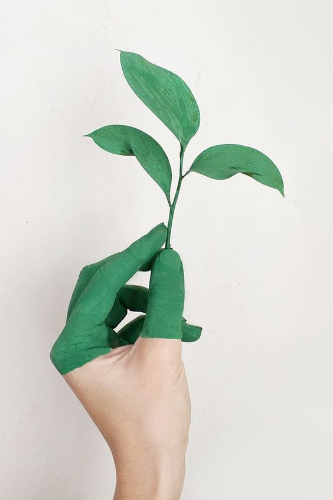

من پریسا پدرام هستم. دکترای روانشناسی از دانشگاه الزهرا دارم. بیش از هشت سال است که در زمینه روانشناسی کودک و نوجوان فعالیت می‌کنم و یاد می‌گیرم.

من در بخش اطفال بیمارستان روزبه با اختلال دوقطبی در کودکان و نوجوانان از نزدیک آشنا شدم. قبل از آن اطلاعاتم در حد کتاب‌ها بود و فکر نمی‌کردم یک روز کار کردن و کمک کردن در این زمینه تبدیل به معنای زندگیم شود.

حدود چهار سال در بخش اطفال به عنوان روان‌درمانگر مشغول  بودم؛ چهار سالی که در کنار بیماران مبتلا به اختلال دوقطبی و خانواده‌هایشان بسیار یاد گرفتم. در روزهای خاکستری بستری شاهد سوگ‌ها و نگرانی‌هایشان بودم  و در روزهای آرام بهبودی به همراه‌شان  نفس عمیق کشیدم.

اختلال دوقطبی در کودکان و نوجوانان در جامعه شناخته شده نیست و معمولا وقتی فرداین تشخیص را می‌گیرد، سوالات زیادی در ذهن خود و اطرافیانش ایجاد می‌شود. امیدوارم این سایت بتواند پاسخگوی بخشی از نگرانی‌های این عزیزان باشد.

هدف ما آگاه‌سازی در زمینه اختلال دوقطبی است و شما آزاد هستید مطالب سایت را با دیگران به اشتراک بگذارید.