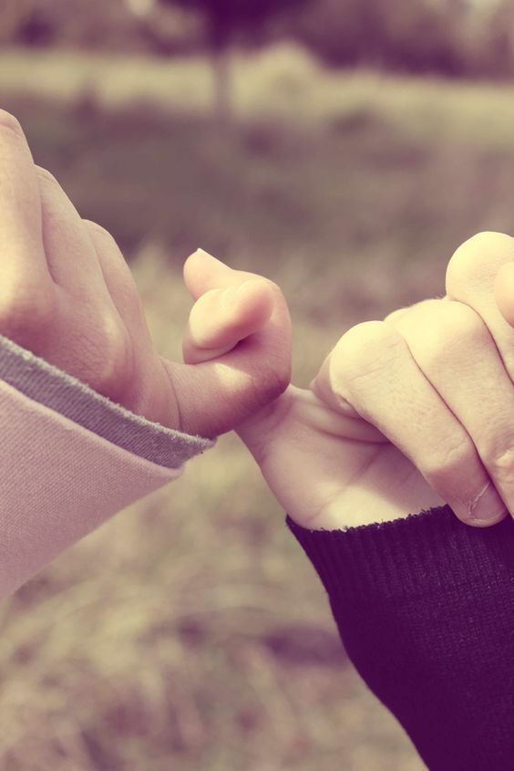

به برنامه درمانت پایبند باش. این باعث می‌شه حالت خوب بمونه و بیشتر از هر چیز دیگه‌ای بهت کمک می‌کنه!

تصمیم بگیر کارای اجتماعی رو شروع کنی. این کار سختی ست. همه ما از طرد شدن می‌ترسیم. ولی اگه تعامل نداشته باشیم اونوقت شانس خیلی از روابط خوب رو هم از دست می‌دیم. کمی ترسناکه، ولی بهش فکر کن: چرا می‌ترسی یکی دوستت نداشته باشه!

خودت رو بشناس. ببین چه وقت‌هایی بیشتر احساس تنهایی می‌کنی. وقتی با خودتی؟ وقتی جای خاصی یا با آدم خاصی هستی؟ و چه وقت‌هایی کمتر این احساس رو داری.

دایره دوستی تشکیل بده. کارهای داوطلبانه، شرکت در یک کلاس یا باشگاه، هر چیزی که ازش لذت می‌بری. تمرکزت رو بذار رو چیز‌هایی که ارزش داره. خیلی‌وقت‌ها به جای این که تمرکزمون رو صرف آدم‌هایی‌ کنیم که دوست‌مون دارن، تمام تلاش‌مون رو می‌کنیم کسایی که دوست‌مون ندارن، دوست‌مون داشته باشن و فقط انرژی از دست می‌دیم.

فضای مجازی رو جایگزین روابط واقعی نکن. حواست باشه مقایسه نکنی. در فضای مجازی  ما قسمت‌های برجسته شده زندگی بقیه رو می‌بینیم نه واقعیت زندگی‌شون رو. پس زندگی بیرونی دیگران رو با زندگی درونی خودت مقایسه نکن.

جلوی تمرکز به خود بایست. توجه کن وقتی با دیگران هستی بیشتر در مورد چی صحبت می‌‌کنی؟ آیا بیشتر تمرکز حرف‌های روی خودته؟ توجه به بیرون از خود نه تنها باعث می‌شه از مشکلاتت دور شی بلکه از تو دوست بهتری می‌سازه.

انتظارات واقع‌بینانه داشته باش. اون دوستی باش که دوست‌ داریش، انتظار نداشته باش همه دوستت داشته باشن، همیشه جوری رفتار کنن که تو دوست داری یا همیشه حال‌شون خوب باشه و یا بدونن تو چی فکر می‌کنی. هر آدمی مشکلات و زندگی خودش رو داره.

با خودت ارتباط برقرار کن. وقتی که کسی نیست به این معنی نیست که تو تنهایی، چه چیزهایی هست که دوست داری وقتی کسی نیست بهش فکر کنی، چه کارهایی دوست داری انجام بدی. بهش فکر کن این باعث می‌شه بیشتر از زندگی لذت ببری.

برنامه داشته باش. وقت‌های افسردگی تنها بودن می‌تونه خطرناک باشه. وارد یه چرخه می‌شیم که هی حالمون رو بدتر می‌کنه. به خودمون می‌گیم هیچ‌کس من رو دوست نداره، من به هیچ‌کس تعلق ندارم. این درست وقتیه که باید براش برنامه داشته باشی. به یکی زنگ بزن، برو بیرون و تنها  نمون.

واکنش برعکس رو تمرین کن. این یه تکنیک مفیده، مثلا وقتی دلت می‌خواد تنها باشی، کار برعکسش رو انجام بده، یعنی برو با دیگران باش. این باعث می‌شه تو اون وضعیت ناخوشایند گیر نکنی.

بقیه رو هم تشویق کن. این راهکار خیلی انگیزه‌بخش ست. وقتی دیگران رو تشویق به این فعالیت‌ها می‌کنی، احساس خوبی که خودت پیدا می‌کنی فوق‌العاده است.

<!-- https://www.instagram.com/p/Bz-TDluoFaa/ -->