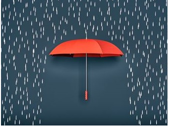

هیچ کس دوست نداره بفهمه که بیماره، اما بعضی وقت‌ها این ‌که بدونی برای بیماریت کمک وجود داره یه جورایی آرامش بخشه. خیلی از بچه ها و نوجوان‌ها مدت‌های خیلی طولانی با بیماریشون درگیرن تا بالاخره موفق میشن کمکی که احتیاج دارن رو دریافت کنن.

نوجوان هایی که بیماری دوقطبی دارن ممکنه فکر کنن که فقط اون‌ها هستن که این مشکل رو دارن. تو تنها نیستی. بعضی متخصص ها معتقدن که تقریبا یک میلیون کودک و نوجوان در امریکا مبتلا به اختلال دوقطبی هستن. اگر تو در حال خوندن این متن هستی، یک مزیت مهم داری، اینه ‌که داری با یادگیری در مورد اختلال دوقطبی، اولین قدم ها رو برای مدیریت بیماریت، بر میداری.

نوجوان‌ها می‌تونن با ثبت کردن روزانه خلق و خوشون مسئولیت کنترل بیماریشون رو به عهده بگیرن. یعنی می‌نویسی که ساعت‌های مختلف روز چه احساسی داری و بدنت به درمان چطور واکنش نشون میده. این به تو کمک می‌کنه که متوجه نوسان یا بالا و پایین رفتن خلق و خوت بشی و به والدین و دکترهات کمک می کنه که بدونن درمانت چطور پیش میره. صحبت کردن با والدین و دکترهات در مورد احساساتت مهمه.

اگر خواستی به خودت آسیب بزنی، همیشه یک نفر که بهش اعتماد داری رو مطلع کن. این می‌تونه یکی از نشونه های بیماریت باشه و چیزی نیست که بخوای ازش خجالت بکشی.ممکنه دکترت داروت رو عوض کنه تا از شر این احساس‌ها راحت شی.

<!-- https://www.instagram.com/p/BzP-dGyiC5b/ -->