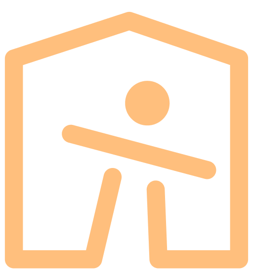

اپلیکیشن کلبه به کوشش انجمن روانپزشکی کودک و نوجوان ایران،‌ برای افزایش آگاهی و توانمندی روان‌شناختی والدین و فرزندان، در بحران همه‌گیری کرونا طراحی شده‌است.

[برای دانلود نسخه اندروید روی ایکون زیر کلیک کنید!](http://78.46.192.51/kolbeh.apk)

