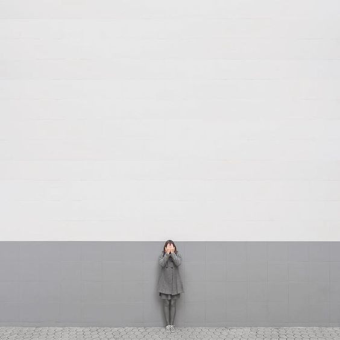
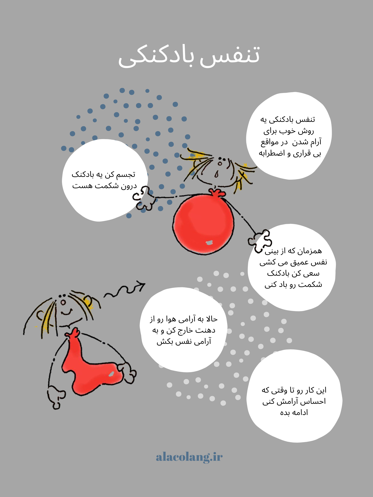

اگر بدانیم چه چیزهایی ما رو آزار می‌دن، بهتر می‌تونیم کنترل‌شون کنیم. برای این که ماشه چکان‌هات رو بهتر بشناسی این سوال‌ها رو از خودت بپرس:

- ماشه چکان های عصبانیت من چیست؟ چطور آن ها را خاموش می‌کنم؟
- ماشه چکان های نگرانی من چیست؟ چطور آن ها را خاموش می‌کنم؟
- ماشه چکان های غمگینی من چیست؟ چطور آن ها را خاموش می‌کنم؟

یکی از روش‌های آرام‌سازی در مواقع عصبانیت و نگرانی تنفس عمیق است. تنفس عمیق ابزاری ست که همیشه و همه جا همراه ماست. بروشور مقابل یکی از روش های تنفس عمیق رو نشون می‌ده.

بروشور بالا رو می‌تونی
[اینجا](/balloon-breathing.pdf)
دانلود کنی.

<!-- https://www.instagram.com/p/BzImCtcBAvr/ -->
<!-- https://www.instagram.com/p/BzImycZBxWM/ -->

