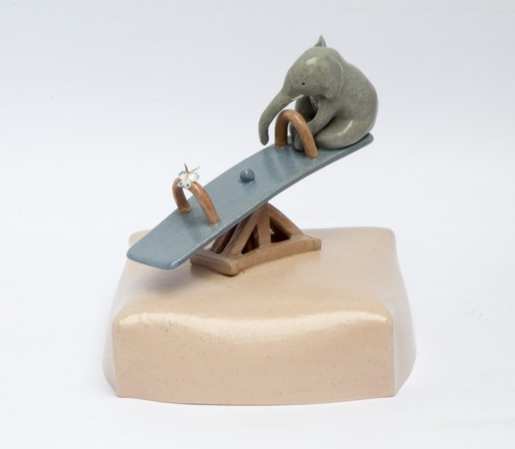

 بهش نگیم: همه اینایی که می‌گی ذهنی است و کنترلش دست خودته!\
بگیم: من می‌فهمم که بیماری تو واقعی است و باعث می‌شه این فکرها و احساس‌ها رو داشته باشی!

نگیم: همه ما یه وقت‌هایی اینطوری می‌شیم!\
بگیم: ممکنه من نتونم دقیقا احساست رو درک کنم، ولی تو برای من مهمی و می‌خوام کمکت کنم!

نگیم: به قسمت‌های خوبش فکر کن!\
بگیم: وقتی کم میاری، به خودت بگو فقط یه روز، یه ساعت و یا یه دقیقه دیگه طاقت بیار. هر چقدر که توانش رو داری!

نگیم: تو چیزهای زیادی داری که براش زنده بمونی، چرا می‌خوای بمیری!\
بگیم: تو برای من مهمی، زندگی تو برای من مهمه!

نگیم: می‌خوای من چکار کنم؟ من نمی تونم شرایط تو رو تغییر بدم!\
بگیم: به من بگو چطور می‌تونم بهت کمک کنم؟

نگیم: خودت رو ازین شرایط بیار بیرون!\
بگیم: ممکنه باورش برات سخت باشه، ولی احساسی که الان داری همین‌طور نمی‌مونه و تغییر می‌کنه!

نگیم: خوب می‌شی، نگران نباش!\
بگیم: تو تنها نیستی، من کنارتم!

<!-- https://www.instagram.com/p/Bz_uHqjIeWQ/ -->