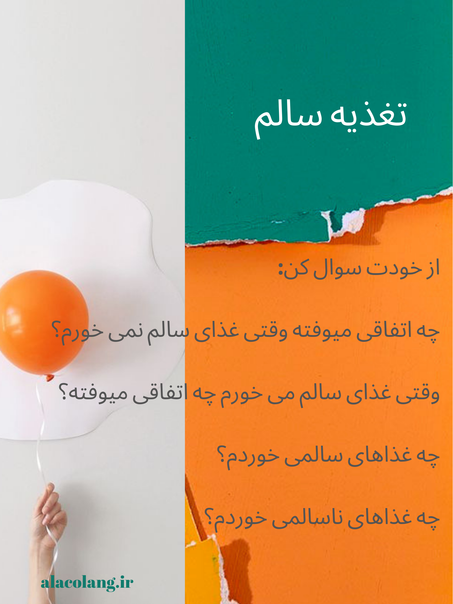

عادت‌های رفتاری درست می‌تونن به تعادل خلق کمک کنن.

 - خواب کافی،
 - تغذیه سالم، و
 - فعالیت مناسب

 عادت‌هایی هستند که کمک می‌کنند خلق‌و‌خوی ما ثبات بیشتری داشته باشه و حال بهتری داشته باشیم. با این انتخاب‌ها شما کنترل بیماری رو در دست‌تون می‌گیرین. در مورد این سه عادت از خودتان سوال کنید و براش تصمیم بگیرین. بروشور‌های مقابل به شما کمک می‌کنه که در این مسیر قدم بردارید.

خواب کافی کمک می‌کنه که نوسان خلق‌مون کم بشه.

در ضمن، فعالیت بدنی مناسب هم در تنظیم خلق‌مون نقش داره.

علاوه بر این‌ها، غذاهای سالم می‌تونند به آرامش‌ ما کمک کنند.

<!-- https://www.instagram.com/p/BzIlft0hBch/ -->
<!-- https://www.instagram.com/p/BzIl2kahvvF/ -->
<!-- https://www.instagram.com/p/BzIluc8hplP/ -->
<!-- https://www.instagram.com/p/BzIln8_hhex/ -->
