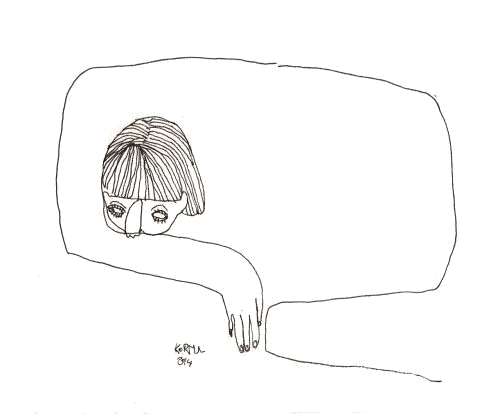

همه آدم‌ها یه وقت‌هایی تنهایی رو تجربه می‌کنن، ولی ابتلا به یه بیماری روانپزشکی مثل دوقطبی، احتمال تنها موندن رو زیاد می‌کنه! برای این که بتونیم این مشکل رو حل کنیم اول باید بدونیم تنهایی چیه و چرا تنها می‌شیم.

تنهایی ضرورتا به معنی تنهایی فیزیکی نیست، تو می‌تونی در یه اتاق خیلی شلوغ هم تنها باشی. تنهایی داستانی است که ما در مورد فاصله‌ای که با آدم‌ها داریم، در ذهن‌مون می‌گیم.

مثلا اگه دوستت بهت زنگ نزنه یا جوابت رو نده چه داستانی به ذهنت میاد: بهت اهمیت نداده یا اینکه سرش شلوغه؟

به داستانی که ذهنت میگه گوش کن و اون رو به چالش بکش!

دوقطبی یه سری مشکلات رو در روابط ایجاد می‌کنه که اگه بشناسیمش می‌تونیم کنترلش کنیم.

#### نوسان خلق

بعضی‌وقت‌ها حالمون خیلی خوبه و بعضی‌وقت‌ها خیلی خیلی بی حوصله‌ایم، این شرایط ارتباط رو برای دوستان و البته خودمون سخت می‌کنه، چون قابل پیش‌بینی نیست صبح که پا می‌شیم چه اتفاقی میوفته!

#### فقدان‌ انرژی و افسردگی

این حالت ما رو به سمت گوشه‌گیری می‌بره و دوستان‌مون درک نمی‌کنن که چرا جواب‌شون رو نمی‌دیم!

#### تفکر تحریف شده

اختلال دوقطبی رو می‌شه به یک اتاق پر از آینه تشبیه کرد، چون انگار همه چیز در مورد ماست!
زمان زیادی رو صرف این می‌کنیم که چقدر احساس بدی از اتفاق‌ها داریم و همه چیز رو شخصی می‌کنیم و به خودمون می‌گیرم.

این چالشی ست که باهاش روبرو هستیم و باعث می‌شه نتونیم برای روابط‌مون وقت کافی بگذاریم و در دسترس دوستان‌مون باشیم.

#### اضطراب

فقط بیماری نیست که باعث اضطراب ما می‌شه، بلکه دیگران هم نگران ما می‌شن.
اگه ما افکار خودکشی داریم و یا اقدام به خودکشی کردیم، واقعا برای دوستان و اطرافیان‌مون نگران‌کننده است اگه جواب تماس‌شون رو ندیم یا منزوی شیم، این چالشی ست که باید ازش آگاه باشیم!

#### احساس درک نشدن

اگر اختلال دوقطبی رو تجربه نکرده باشی، واقعا نمی‌تونی درکش کنی. ما می‌تونیم همه تلاش‌مون رو بکنیم که به بقیه آگاهی بدیم تا بهتر متوجه ما بشن. ولی این احساس مداومِ درک‌نشدن چیزیه که واقعا دردناک ست. به همین دلیل است که به دنبال حمایت مناسب در زندگی هستیم.

راه‌حل این مشکلات رو در
[پست راه‌های غلبه بر احساس تنهایی ](./coping-with-loneliness)
بخونید.

<!-- https://www.instagram.com/p/Bz3vBAsoKiO/ -->