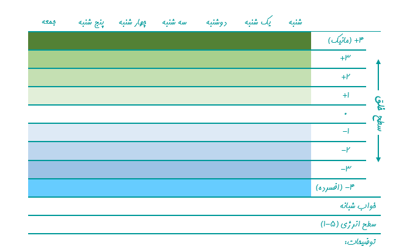

#### جدول خلق چیست؟

جدول خلق یه وسیله ست برای این که سطح خلق‌و‌خو، میزان خواب و انرژی  رو توش ثبت کنیم. این وسیله کمک می‌کنه متوجه تغییرات خلق و خو و خوابمون بشیم. با ارزیابی خلق تو می‌تونی به تغییرات خلقیت و نشانه‌های اولیه عود آگاه بشی. جدول خلق وسیله خوبی ست که کمک می‌کنه کنترل بیماری رو در دستت بگیری!

#### جدول خلقت رو  طراحی کن

انتخاب‌های زیادی برای درست کردن جدول خلق وجود داره! تو می‌تونی با ابزارهای کامپیوتری جدول درست کنی، می‌تونی با کاغذ و مداد رنگی و خط کش جدولت رو درست کنی و یا می‌تونی تو تقویم روزانه  ثبتش کنی. پینترست و اینستاگرام هم ایده‌های خوبی برای جدول خلق بهت میده!
یک گزینه دیگه، اپلیکیشن‌های گوشی‌همراه هستن با جستجوی کلمات _mood chart_ یا _mood tracker_  می‌تونی پیداشون کنی. می‌تونی هر روز از خودت عکس بگیری و یه گزارش خلق تصویری داشته باشی!

#### خواب، انرژی و خلقت رو اندازه گیری کن

می‌تونی از خودت بپرسی:

- دیشب چند ساعت خوابیدم؟
- الان انرژیم چند درجه است؟ (از یک تا پنج نمره بده)
- به خلقم چه نمره‌ای بدم؟  (از یک تا ده)

#### پایش خلق رو تبدیل به یک عادت منظم کن

تنها راهی که جدول خلق می‌تونه به تو و دکترت کمک کنه این ست که هر روز انجامش بدی. اگه یک روز یادت بره ممکنه اطلاعات مهمی رو فراموش کنی یا آن‌ها رو کم اهمیت بدونی. برای این که مطمئن شی هر روز انجامش می‌دی این سه قانون رو رعایت کن:

- **یادآوری:**
برای خودت یادآور بذار. مثلا درست قبل از صبحانه یا ناهار یا شام می‌نویسمش.
- **روتین:**
هر روز با یک شیوه مشخص و تکراری انجامش بده تا ذهن و جسمت آماده  انجامش باشه.
- **پاداش:**
برای این که بتونی این کار رو ادامه بدی برای انجامش جایزه تعیین کن. مثلا اگر سه روز پشت سر هم انجامش بدم یه جایزه به خودم می‌دم!

#### پیشرفتت رو ارزیابی کن

پایش خلق روش خوبی ست تا متوجه شی که اثر داروهای جدیدت چطور بوده و چقدر در طول هفته یا ماه نوسان خلق داشتی. این اطلاعات به پزشکت کمک می‌کنه بهتر روند درمان رو پیش ببره. پس می‌تونی هر وقت پیش پزشکت می‌ری پایش خلقت رو هم ببری و با هم پیشرفتت رو بررسی کنین.

> یادت باشه که با این کار داری به مغزت این پیام رو می‌دی که به بیماریت اشراف داری و می‌تونی بهش غلبه کنی.

فرم مقابل یک نمونه جدول پایش خلق ست که می‌تونی از
[اینجا](/mood-chart.pdf)
 دانلودش کنی و ازش استفاده کنی!

وقتی تکمیلش کنی، یه چیزی مثل این می‌شه:

<!-- https://www.instagram.com/p/B0cJgipI3c9/ -->