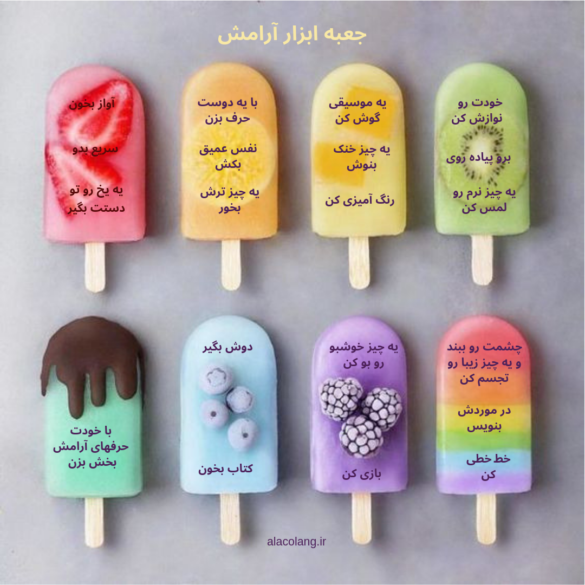

احتمالا متوجه شدی که وقتی خلقت بالاست یا پایینه خیلی زود عصبانی می‌شی و از کوره در می‌ری. عصبانیت یه احساسه که همه دارن و کمک می‌کنه که از حقمون دفاع کنیم ولی بعضی‌وقت‌ها آنقدر شدید است که ممکنه اذیتمون کنه و یا دیگران رو اذیت کنیم. آدم‌های مختلف از طریق چیزهای مختلفی آروم می‌شن. خوبه که هر کس بدونه چه چیزهای خاصی اون رو آروم می‌کنه و براش آماده باشه.

می‌شه یه جعبه درست کرد و چیزهای آرامش‌بخش رو توش گذاشت یا می‌شه لیستی آماده کرد تا وقتی عصبانی هستیم بریم سراغش. از خودت بپرس که کدوم یکی از این روش‌ها می‌تونن در جعبه ابزار تو قرار بگیرن.

<!-- https://www.instagram.com/p/BzjK5tzCNNU/ -->