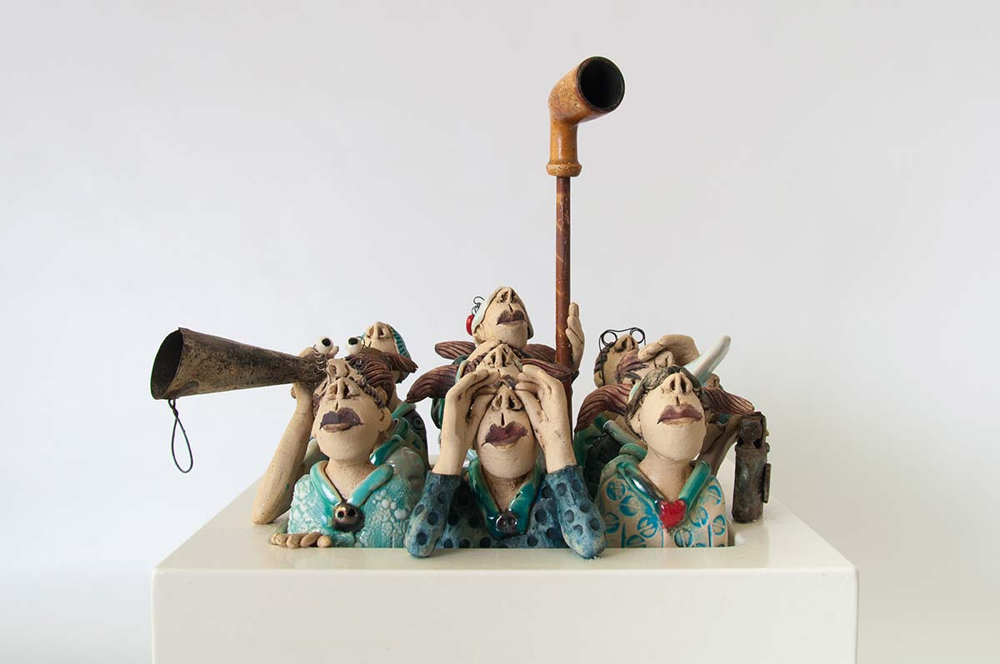

اگر اختلال دوقطبی داری، احتمالا نظرات بی‌ملاحظه زیادی در مورد خودت شنیدی و احساس کردی که دیگران دارن قضاوتت می‌کنند.

به یاد داشته باش آن آدم‌ها نمی‌دونند اختلال دوقطبی چیست. هر چند ممکنه سخت باشه، ولی تلاش کن نظرات آنها رو به خودت نگیری و شخصی نکنی. آنها نمی‌تونند تشخیص بدن که اختلال دوقطبی درست مثل سرطان و یا فشار خون بالا، یک مشکل پزشکی است و نیاز به درمان داره. ابتلا به اختلال دوقطبی تو رو ضعیف‌تر  یا کمتر از بقیه نمی‌کنه.

#### برچسب چیست؟

برچسب همون مودبانه‌ی تبعیض یا اَنگه. یه باور منفی است که آدم‌ها در مورد یه چیزی دارن و متوجه نیستن که می‌تونه باعث آزار  ذهنی و هیجانی دیگران بشه. وقتی یه نفر تفکر برچسبی داره، به این معنی است که یه مشکلی در فکر او وجود داره و نه در تو. مردم نظرات آزاردهنده و دردناکی در مورد بیماری‌های روانپزشکی دارن چون نمی‌دونن که بیماری روانپزشکی هم یه مشکل پزشکی است. بهترین راه برای مقابله با برچسب بیماری روانپزشکی کمک کردن به مردم برای درک بهتر بیماری‌ها است. پس تا می‌تونی به دیگران آگاهی بده.

<!-- https://www.instagram.com/p/Bzm5CP6i2Na/ -->