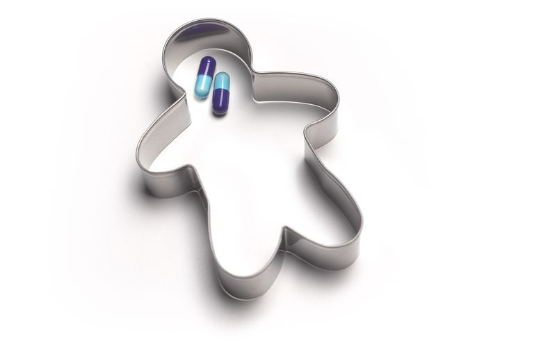
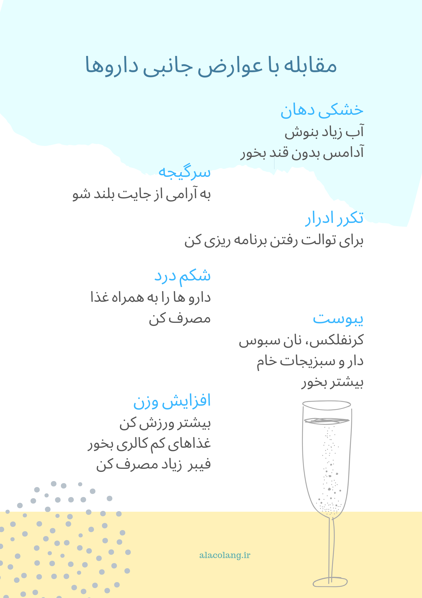

خوردن دارو، کار خوشایندی نیست به خصوص وقتی قراره برای مدت طولانی استفاده بشه. به خصوص که گاهی از دست عوارضش کلافه می‌شیم. و یا یه وقتایی وسط پریشون‌حالیمون یهو بهمون می‌گن داروهات رو خوردی! دارو یه جورایی مثل سیلی می‌خوره تو صورت‌مون.

یه سری ترفند هست که بچه‌ها و نوجوان‌هایی که شرایط مشابه تو دارن، استفاده می‌کنن تا دارو خوردن براشون راحت‌تر شه و من اینجا نقل قول می‌کنم:

> من هر صبح وقت دارو خوردن بد خلقم. اگر داروهام رو بدون عصبانیت بخورم یه سکه تو قلکم می‌ندازم و خودم رو تشویق می‌کنم.

> دارو خوردن رو تبدیل به یه کار جالب کردم، خودم رو بعد دارو به یه چیز خوشمزه مهمون می‌کنم.

> من با مامانم مسابقه میدیم ببینیم کی زودتر داروهاشو میخوره.

> بعضی وقت‌ها من واقعا دلم نمی خواد دارو بخورم با این حال میدونم مجبورم بخورم. بعد با خودم میگم من باید داروم رو با یه نوشیدنی که خیلی دوست دارم بخورم و این خیلی کمک می‌کنه.

> من باید داروهامو بخورم چون باعث میشه احساس بهتری داشته باشم. من بعد داروهام کمی بستنی می‌خورم.

> من داروهام رو با پوره سیب می خورم تا راحت تر قورتشون بدم.

> من از تخیلم استفاده می‌کنم و وانمود می‌کنم که داروهام آبنبات هستن و سریع قورتشون می‌دم. من ازشون خوشم نمیاد ولی می‌خورمشون چون آرومم می‌کنن.

تو هم می‌تونی ازین روش ها برای خوردن داروهات استفاده کنی یا روش‌های خلاقانه منحصر به فرد دیگه‌ای خلق کنی که دارو خوردن برات آسون تر شه.

اگر عوارض جانبی داروهااذیتت می‌کنه بروشور مقابل رو بخون! یا از
[اینجا](/side-effects.pdf)
 دانلود کن.

<!-- https://www.instagram.com/p/BzVPGYjC1kd/ -->
<!-- https://www.instagram.com/p/BzInEdzBmy_/ -->