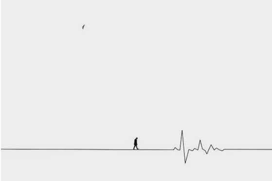
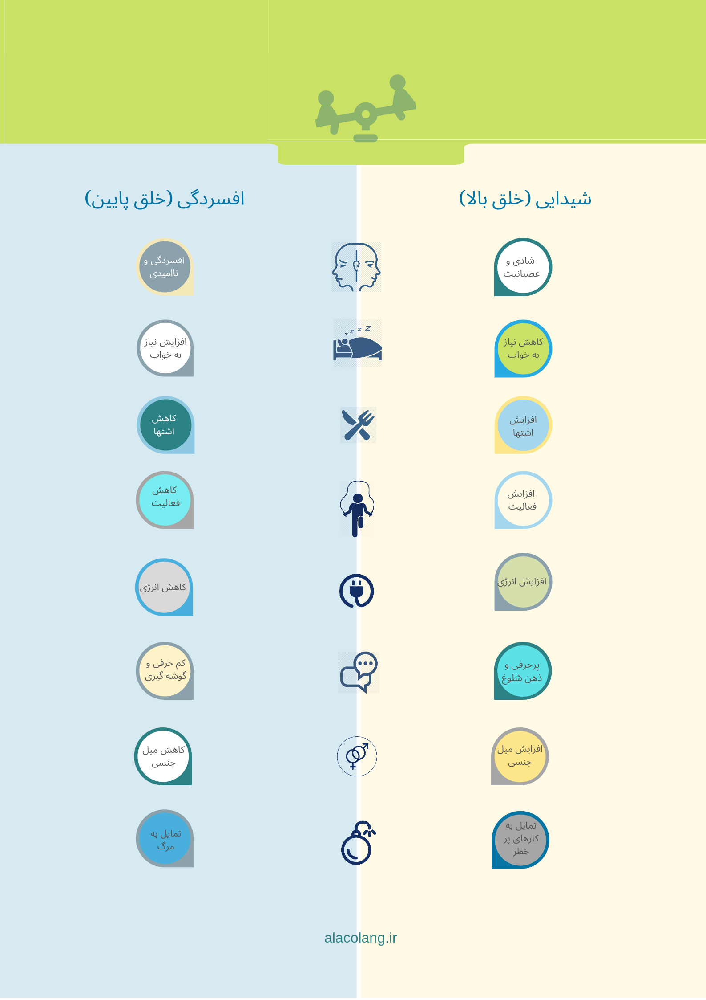

اختلال دوقطبی یه بیماری است که روی انرژی، روحیه، فکرهات و کارهایی که انجام میدی، اثر میذاره. می‌تونه باعث بشه که بدنت سنگین و خسته و یا سبک و پر انرژی بشه. می‌تونه باعث بشه که روحیه‌ات غمگین و افسرده، سرخوش و خیلی شاد، عصبانی و بی‌قرار و یا نگران و مضطرب بشه.

می‌تونه باعث بشه که فکرهات خیلی کند و یا خیلی سریع بشن و تمرکز کردن برات خیلی کار سختی باشه. می‌تونه باعث بشه رفتارهایی انجام بدی که خیلی با شخصیتت فرق داره. یک آدم آروم ممکن است خیلی پر حرف بشه و یا یک آدم صمیمی ممکن است دلش نخواد کنار بقیه بمونه.

این تغییرها ممکن است تو، خانواده و دوستانت رو گیج کنه. دانشمندها هنوز به دنبال دلایل این بیماری هستند. آن‌ها متوجه شدن که این بیماری می‌تونه ارثی باشه. تو هیچ کار اشتباهی نکردی که این بیماری رو گرفتی.

بیماری دوقطبی از بین نمیره ولی خبر خوب این است که درمان می‌تونه کنترلش کنه و گاهی خاموشش کنه. تو، دکتر و والدینت تصمیم می‌گیرین که چطور این بیماری رو مدیریت کنین تا زندگی خیلی خوبی داشته باشی. معمولا درمان بیماری دوقطبی شامل
این هاست: دارو، روان‌درمانی، تغییر سبک زندگی و کم کردن استرس هات.

این‌ها در کنار هم کمک می‌کنن که روحیه‌ات با ثبات بمونه و حالت خوب باشه. نشانه های خلق بالا و پایین رو  می‌تونی در بروشور پایین ببینی یا از
[اینجا](/symptoms.pdf)
 دانلود کنی.

<!-- https://www.instagram.com/p/BzIlUwjBpq6/ -->